

# Documentación Técnica Visual de HitSchool

## Carta ASM Simplificada

La siguiente documentación presenta los flujos principales de la plataforma usando diagramas Mermaid con el formato de Carta ASM Simplificada, adaptado a la arquitectura funcional de HitSchool.

## 1. Flujo de Acceso y Autenticación

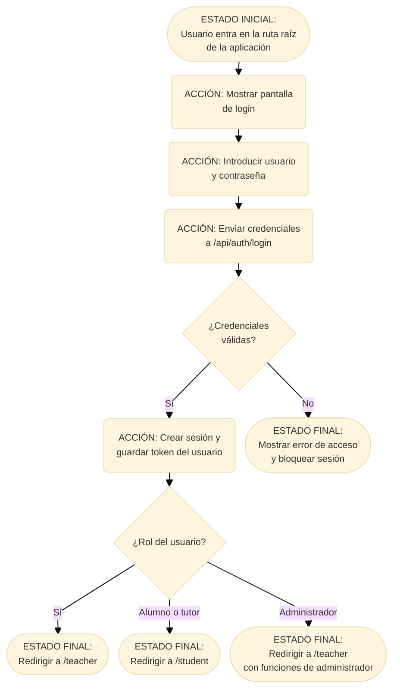

| Elemento | Descripción |
| :--- | :--- |
| **Entradas / Evento** | Inicio de sesión desde la raíz de la plataforma con credenciales del usuario |
| **Condiciones Clave** | ¿Credenciales válidas?; ¿Qué rol tiene el usuario? |
| **Salida / Cambio de Estado** | Se crea una sesión autenticada. Profesores y administradores entran en /teacher; alumnos y tutores entran en /student. |

## 2. Flujo de Creación y Duplicación de Clases

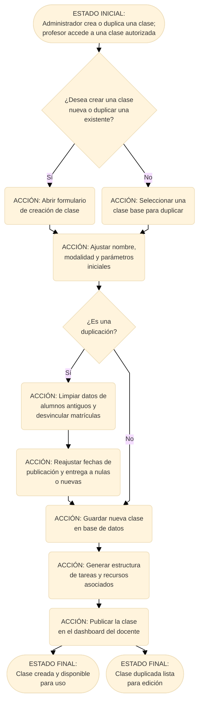

| Elemento | Descripción |
| :--- | :--- |
| **Entradas / Evento** | El administrador crea o duplica una clase; el titular o un profesor asignado trabaja dentro de ella. |
| **Condiciones Clave** | Crear, editar, duplicar, asignar profesores y limpiar matrículas requieren permisos distintos. |
| **Salida / Cambio de Estado** | La clase queda guardada y disponible solo para el administrador, el titular y los profesores asignados. |

## 3. Flujo Ciclo de Tareas y Evaluaciones

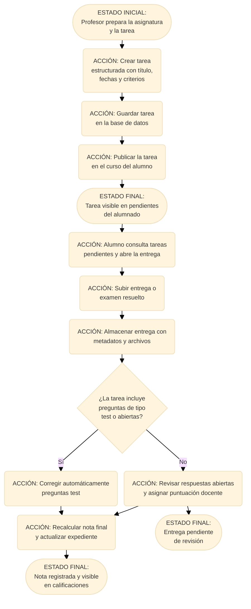

| Elemento | Descripción |
| :--- | :--- |
| **Entradas / Evento** | Creación de una tarea de clase o individual y posterior entrega del alumno. |
| **Condiciones Clave** | Publicación inmediata o programada, tarea plantilla o activa, pasos evaluables y preguntas abiertas. |
| **Salida / Cambio de Estado** | Se guardan entregas, se corrigen, se recalculan las notas por clase y se notifica a los destinatarios autorizados. |

## 4. Flujo de Administración y Gestión de Usuarios

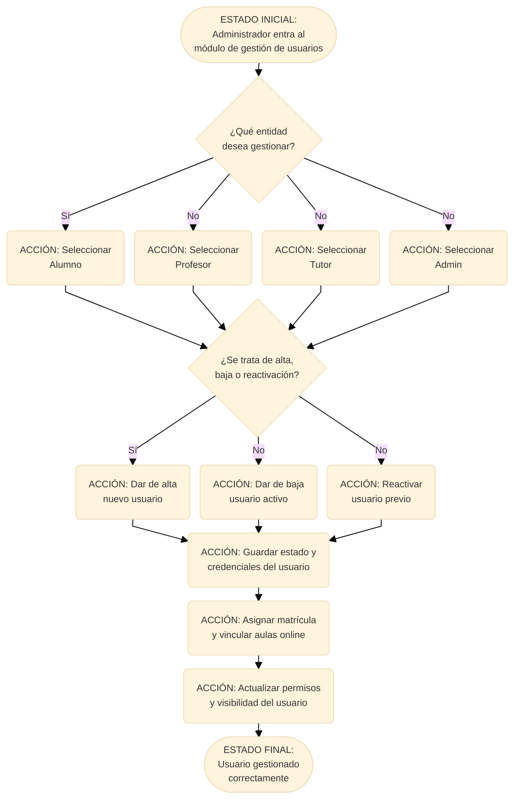

| Elemento | Descripción |
| :--- | :--- |
| **Entradas / Evento** | Selección de una entidad y decisión de alta, baja o reactivación |
| **Condiciones Clave** | ¿Qué entidad se gestiona?; ¿Qué acción corresponde? |
| **Salida / Cambio de Estado** | El usuario queda activo, inactivo o reactivado y recibe la matrícula y permisos adecuados |

## 5. Flujo de Pagos e Impagos

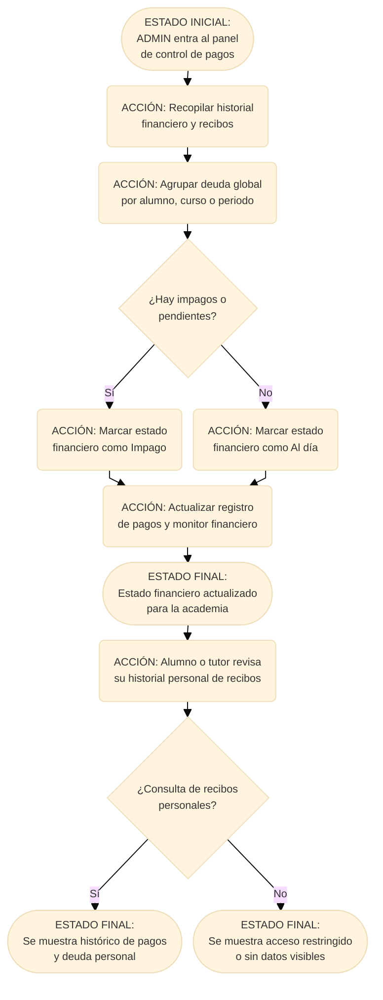

| Elemento | Descripción |
| :--- | :--- |
| **Entradas / Evento** | Consulta de pagos globales por parte del ADMIN o histórico personal por parte del alumno/tutor |
| **Condiciones Clave** | ¿Hay impagos?; ¿Se está consultando el historial personal o la vista global? |
| **Salida / Cambio de Estado** | Se actualiza el estado financiero y se muestra la información permitida por rol |

## 6. Flujo de Comunicación y Lectura de Mensajes

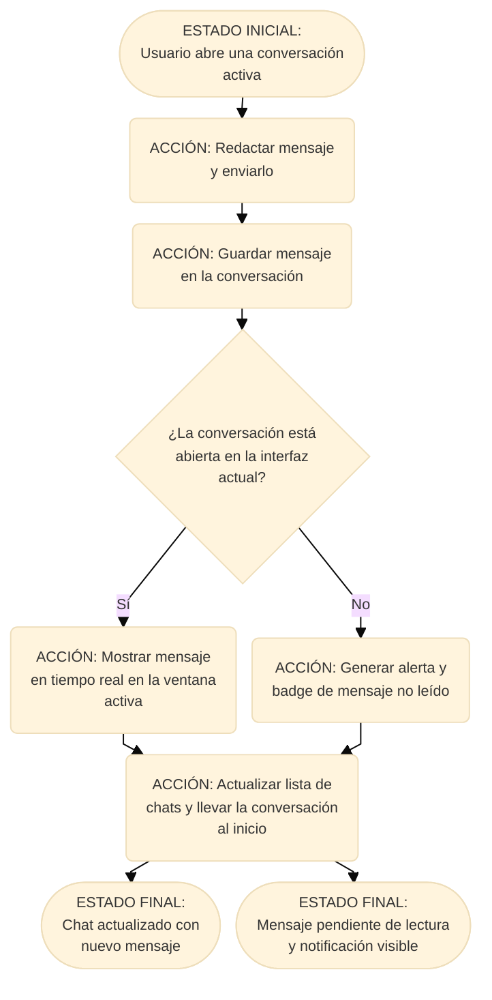

| Elemento | Descripción |
| :--- | :--- |
| **Entradas / Evento** | Envío de un mensaje entre profesor y alumno |
| **Condiciones Clave** | ¿La conversación está abierta?; ¿La vista está activa en ese momento? |
| **Salida / Cambio de Estado** | El mensaje se entrega, se marca como leído o no leído y la conversación se reordena al inicio |

## 7. Flujo de Consulta de Expediente Académico

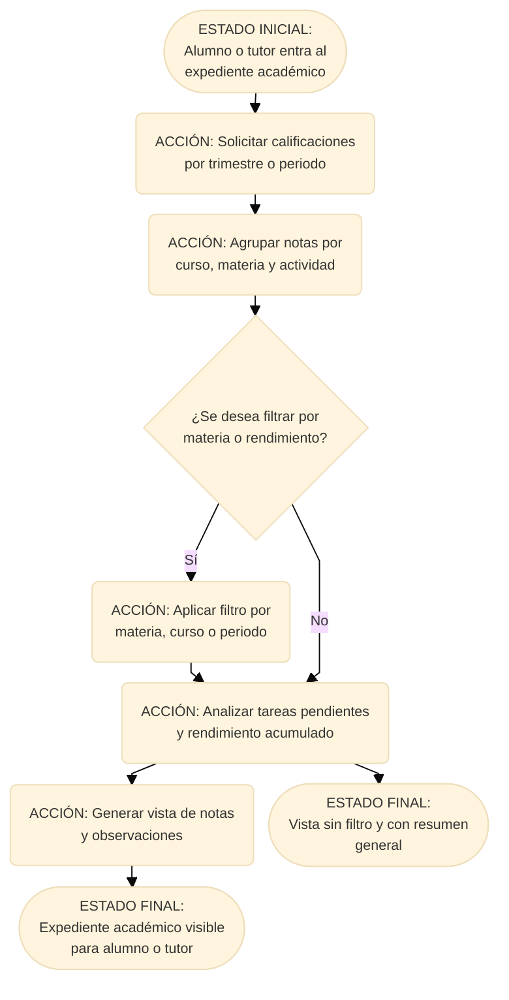

| Elemento | Descripción |
| :--- | :--- |
| **Entradas / Evento** | Acceso al expediente del alumno o tutor para consultar notas y rendimiento |
| **Condiciones Clave** | ¿Se aplica un filtro?; ¿Hay tareas pendientes o rendimiento bajo? |
| **Salida / Cambio de Estado** | Se genera la vista final con notas, materias y análisis académico |

## 8. Flujo de Permisos de Clase y Profesores Asignados

```mermaid
flowchart TD
  A([Usuario solicita una clase]) --> B{¿Qué rol tiene?}
  B -- Administrador --> C([Acceso global])
  B -- Profesor --> D{¿Es titular o está asignado?}
  D -- Sí --> E([Acceso a alumnos, tareas, anuncios y calificaciones])
  D -- No --> F([Acceso denegado])
  E --> G{¿Gestionar colaboradores?}
  G -- Añadir --> H([Titular o asignado puede añadir profesor])
  G -- Retirar --> I([Solo administrador puede retirar])
```

| Elemento | Descripción |
| :--- | :--- |
| **Entradas / Evento** | Profesor accede a una clase, crea contenido o consulta datos académicos. |
| **Condiciones Clave** | El profesor debe ser titular o figurar en `CourseTeacher`; el alumno debe estar matriculado. |
| **Salida / Cambio de Estado** | Se concede acceso únicamente al ámbito de la clase autorizada. |

## 9. Flujo de Calificaciones por Clase y por Alumno

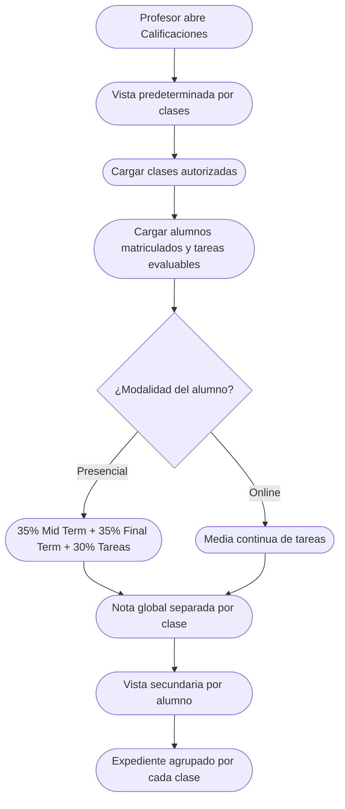

| Elemento | Descripción |
| :--- | :--- |
| **Entradas / Evento** | Consulta de calificaciones de un profesor, alumno, tutor o administrador. |
| **Condiciones Clave** | Cada registro combina `studentId`, `courseId`, trimestre y año académico. |
| **Salida / Cambio de Estado** | Las notas no mezclan clases; un alumno matriculado en varias clases conserva una nota independiente en cada una. |

## 10. Flujo de Materiales y Exámenes Interactivos

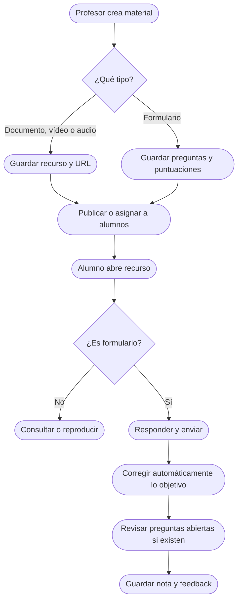

| Elemento | Descripción |
| :--- | :--- |
| **Entradas / Evento** | Alta, edición, duplicación, asignación o entrega de un material. |
| **Condiciones Clave** | Tipo de recurso, nivel, categoría, preguntas abiertas y estado de la entrega. |
| **Salida / Cambio de Estado** | El recurso queda disponible y la entrega actualiza el expediente cuando está evaluada. |

## 11. Flujo de Notificaciones y Novedades

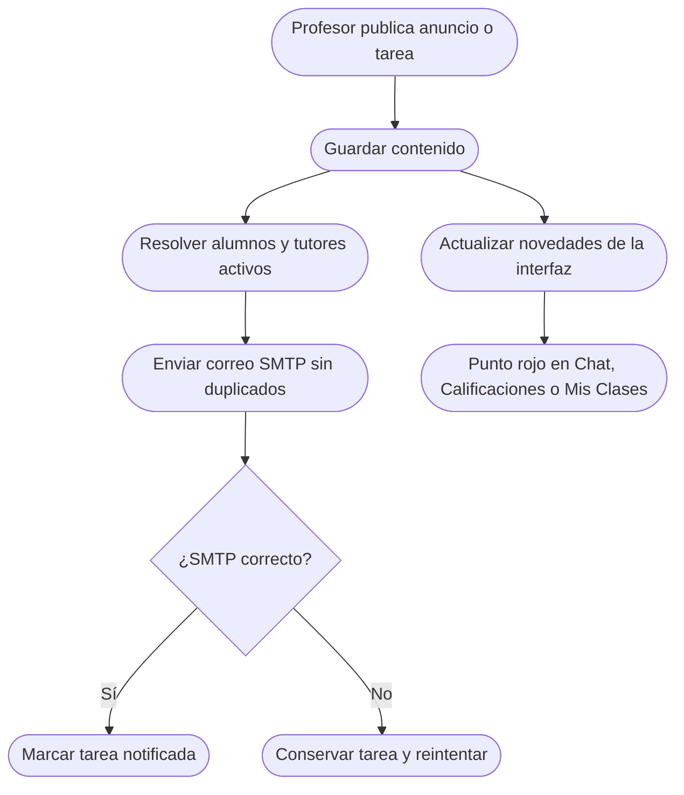

| Elemento | Descripción |
| :--- | :--- |
| **Entradas / Evento** | Publicación de anuncio, tarea, calificación o mensaje nuevo. |
| **Condiciones Clave** | Solo cuentas activas reciben correo; las tareas programadas esperan a `publishAt`. |
| **Salida / Cambio de Estado** | Se envía correo, se reintenta si falla y se muestra la novedad hasta que el usuario la consulta. |

## 12. Flujo de Matrículas, Pagos y Tutores

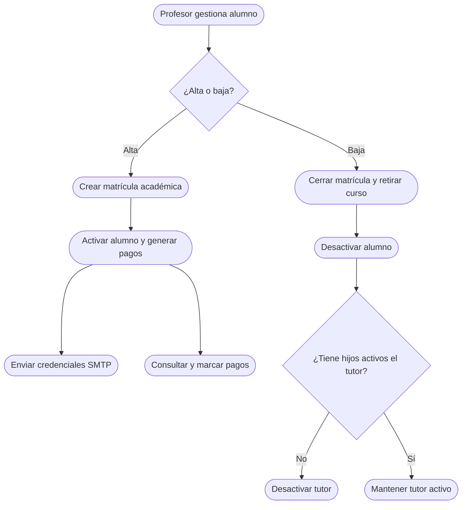

| Elemento | Descripción |
| :--- | :--- |
| **Entradas / Evento** | Alta, baja, reactivación, matrícula, consulta o actualización de pagos. |
| **Condiciones Clave** | La cuenta se activa con matrícula; la baja elimina matrículas de cursos y puede desactivar al tutor. |
| **Salida / Cambio de Estado** | Se actualizan estado, pagos, visibilidad, credenciales y acceso familiar. |

## Resumen general del sistema

HitSchool combina doce flujos funcionales agrupados en cuatro capas:

- Acceso y autenticación
- Gestión académica y curricular
- Administración operativa y financiera
- Comunicación, notificaciones y seguimiento del alumno

Cada flujo mantiene una visión clara del estado del usuario, la actividad del curso y el resultado académico, con reglas de acceso diferenciadas por rol, separación de calificaciones por clase y actualización continua de la base de datos y la interfaz.

