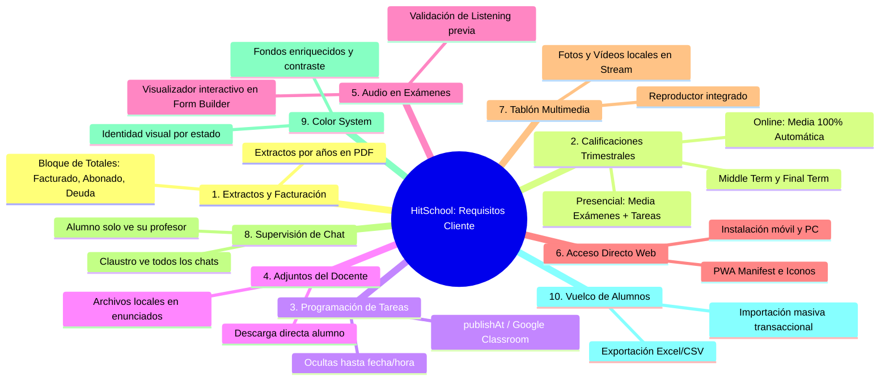

# 🏗️ Plan Maestro de Refactorizaciones & Especificación Técnica — HIT SCHOOL

---

## 📌 1. Visión General y Estado de la Arquitectura

HitSchool ha evolucionado desde un MVP educativo hacia una plataforma integral para academias de idiomas. Este documento recoge:
1. Las refactorizaciones arquitectónicas ya completadas para estabilizar el sistema y unificar el motor de tareas.
2. El análisis técnico, diseño de datos y estrategia de implementación para los **11 requisitos acordados en la última reunión con el cliente**.

---

## ✅ 2. Refactorizaciones Arquitectónicas Completadas

### 2.1 Motor Unificado de Tareas y Catálogo de Plantillas (`Opción A`)
- **Problema previo:** Convivían tres mecanismos de asignación fragmentados (`Assignment`, `MaterialAssignment` y `StructuredTask`), provocando duplicidad de tablas, pérdida de notas al editar y ausencia de fechas límite en tareas por pasos.
- **Solución implementada:**
  - Se amplió el modelo `StructuredTask` con `description`, `dueDate`, `isTemplate` y `category`.
  - **Catálogo Central de Plantillas (`isTemplate: true`):** Los profesores pueden diseñar tareas modelo de 1 o $N$ pasos y reutilizarlas en cualquier clase con 1 clic.
  - **Duplicación profunda:** Clonación de cuestionarios (`POST /api/materials/:id/duplicate`) y tareas completas (`POST /api/structured-tasks/:id/duplicate`) con aislamiento de notas de alumnos existentes.
  - **Edición no destructiva:** Reconciliación en `PUT /api/structured-tasks/:id` que preserva entregas y calificaciones previas.
  - **Componente Unificado `TaskCard.tsx`:** Mismo estándar visual (porcentaje, fechas límite, badges) en «Mis Clases» (`StudentCourses.tsx`) y en «Trabajo de Clase» (`StudentClassworkTab.tsx`).

### 2.2 Hotfixes de Estabilidad y Calidad de Código
- **Desacoplamiento en `FormPlayer.tsx`:** Se separó el guardado del examen (`onFinish`) del cierre del modal (`onClose`), permitiendo que el alumno vea su nota (`GRADE`) y acceda a la revisión (`REVIEW`) sin cierres abruptos.
- **Activación de Ajustes de Cuenta para Alumnos:** Habilitado el acceso a `SettingsModal.tsx` para el rol `STUDENT` para cambio de credenciales y consulta de cuota.
- **Pestañas Integradas:** Conexión de `StudentGradesTab.tsx` y `StudentPeopleTab.tsx` en `StudentCourseView.tsx`, y `GradesTab.tsx` en `CourseView.tsx`.
- **Limpieza TypeScript:** 0 errores de compilación (`tsc -b`), eliminación de rutas duplicadas en `courses.ts` y soporte de permisos para rol `ADMIN`.

---

## 🚀 3. Análisis Técnico & Plan de Desarrollo: 11 Puntos del Cliente

A continuación se detalla el análisis de impacto, arquitectura de base de datos, endpoints de backend y componentes de frontend para cada requerimiento:



---

### 🔹 Punto 1: Extractos de Pago por Años y Desglose de Totales `[x COMPLETADO]`

- **Diagnóstico:** El extracto global de pagos emitía todas las mensualidades sin distinción de ejercicio anual y carecía de una caja resumen de deuda/abonado.
- **Solución Técnica Aplicada:**
  - **Frontend / Utilidad PDF ([`invoice.ts`](file:///c:/Users/PC1/Desktop/HitSchool/HIT_SCHOOL/frontend/src/utils/invoice.ts)):**
    - Se modificó `StatementData` para admitir `year?: number | string | null`.
    - La cabecera refleja el ejercicio (`Ejercicio: 2026` o `Ejercicio: Histórico Completo`).
    - Se añadió fila de pie de tabla (`foot`) en `jspdf-autotable` y estilizado condicional de celdas (verde para *Pagado*, rojo para *Impago*).
    - Se incorporó un bloque con 3 tarjetas métricas destacadas:
      - `TOTAL FACTURADO (€)` con conteo de mensualidades.
      - `TOTAL ABONADO (€)` con conteo de cuotas satisfechas.
      - `SALDO PENDIENTE (€)` (rojo con deuda activa, verde con `0,00 €` y texto *"Al corriente de pago"*).
    - Paginación dinámica `Página X de Y`.
  - **Interfaces ([`TeacherPayments.tsx`](file:///c:/Users/PC1/Desktop/HitSchool/HIT_SCHOOL/frontend/src/pages/TeacherPayments.tsx) y [`StudentPayments.tsx`](file:///c:/Users/PC1/Desktop/HitSchool/HIT_SCHOOL/frontend/src/pages/StudentPayments.tsx)):**
    - Selectores desplegables de año calculados a partir de los pagos reales.
    - Filtrado reactivo de las tarjetas de mensualidad y botones contextuales de descarga.

---

### 🔹 Punto 2: Calificaciones Trimestrales (Middle Term & Final Term)

- **Requisito del Cliente:**
  - Cada trimestre tiene 2 hitos: **Middle Term** (mitad de trimestre) y **Final Term** (final de trimestre).
  - **En modalidad Presencial:** La nota final del trimestre debe ser una media combinada entre las calificaciones formales de exámenes (*Middle* y *Final Term*) introducidas por Laura y el promedio de las tareas/entregas realizadas.
  - **En modalidad Online:** La calificación final debe ser **100% automática**, calculándose en tiempo real mediante el promedio de todas las tareas, cuestionarios y entregas del trimestre.
- **Diseño de Base de Datos:**
  - Extender `schema.prisma` con el modelo `TermGrade`:
    ```prisma
    model TermGrade {
      id            String       @id @default(uuid())
      studentId     String
      courseId      String
      term          Int          // 1, 2 o 3 (Trimestre)
      academicYear  String       // ej: "2025-2026"
      middleScore   Float?       // Nota examen intermedio
      finalScore    Float?       // Nota examen final
      tasksAvgScore Float?       // Media calculada de tareas
      overallScore  Float?       // Nota final definitiva
      feedback      String?
      isAutomatic   Boolean      @default(false) // true para online
      createdAt     DateTime     @default(now())
      updatedAt     DateTime     @updatedAt

      student       User         @relation(fields: [studentId], references: [id], onDelete: Cascade)
      course        Course       @relation(fields: [courseId], references: [id], onDelete: Cascade)

      @@unique([studentId, courseId, term, academicYear])
    }
    ```
- **Lógica de Negocio (Backend):**
  - Endpoint `GET /api/grades/terms/:courseId`: Retorna la matriz de notas trimestrales del curso.
  - Endpoint `PUT /api/grades/terms/:courseId`: Guarda notas manuales (*Middle/Final*) y recalcula medias.
  - **Algoritmo de cálculo:**
    - *Presencial:* `overallScore = ( (middleScore * 0.35) + (finalScore * 0.35) + (tasksAvg * 0.30) )` o ponderación 50% exámenes / 50% tareas configurable.
    - *Online:* `overallScore = tasksAvgScore` (calculado agregando todas las entregas del trimestre con fecha dentro del rango del trimestre).
- **Frontend:**
  - En `TeacherGrades.tsx` y `GradesTab.tsx`: Selector de trimestre (*1º Trimestre, 2º Trimestre, 3º Trimestre*) con columnas para *Middle Term*, *Final Term*, *Media Tareas* y *Nota Final*.
  - Indicador visual para diferenciar alumnos Presenciales (campos editables) de Online (campos calculados en tiempo real con icono de candado/autocalculado).
  - Boletín trimestral descargable en PDF para alumnos y tutores.

---

### 🔹 Punto 3: Programación Diferida de Tareas (Estilo Google Classroom)

- **Requisito del Cliente:** Al crear una tarea, poder programarla para que se publique en una fecha y hora futura, manteniéndose invisible para los alumnos hasta ese momento.
- **Diseño de Base de Datos:**
  - Añadir en `StructuredTask` y `Assignment`:
    - `publishAt DateTime?` (si es `null` o $\le$ `now()`, está publicada inmediatamente; si es $>$ `now()`, está programada).
- **Backend:**
  - En las consultas de alumnos (`GET /api/structured-tasks/course/:courseId`, `GET /api/materials/course/:courseId`):
    - Filtrar con cláusula `WHERE publishAt IS NULL OR publishAt <= NOW()`.
  - En las consultas del profesor:
    - Retornar todas las tareas, acompañadas del flag `isScheduled: Boolean`.
- **Frontend:**
  - En el modal de creación de tareas: Campo opcional *"Programar publicación (Fecha y hora)"*.
  - En la lista de tareas del docente: Badge azul *«⏰ Programada para el DD/MM a las HH:mm»*.

---

### 🔹 Punto 4: Adjuntar Archivos del Profesor en Tareas

- **Requisito del Cliente:** Poder adjuntar archivos locales (guías PDF, audios de apoyo, fichas de trabajo) directamente a la tarea para descarga del alumno.
- **Backend:**
  - Configuración de almacenamiento local seguro mediante `multer` en `backend/uploads/tasks/`.
  - Modelo `TaskAttachment`:
    ```prisma
    model TaskAttachment {
      id        String         @id @default(uuid())
      taskId    String
      fileName  String
      fileUrl   String
      fileSize  Int
      mimeType  String
      task      StructuredTask @relation(fields: [taskId], references: [id], onDelete: Cascade)
    }
    ```
  - Endpoint de descarga segura y servicio estático autenticado `/api/uploads/tasks/:file`.
- **Frontend:**
  - Zona de arrastrar y soltar (*Dropzone*) en el Form Builder de tareas.
  - En la vista del alumno: Sección *"Archivos adjuntos por el profesor"* con botón de descarga directa y previsualización.

---

### 🔹 Punto 5: Previsualización de Audios en el Creador de Exámenes

- **Requisito del Cliente:** En el modal de creación de cuestionarios interactivos, al ingresar o seleccionar un audio para una pregunta de Listening, debe verse y probarse inmediatamente.
- **Frontend ([`MaterialsManagement.tsx`](file:///c:/Users/PC1/Desktop/HitSchool/HIT_SCHOOL/frontend/src/pages/MaterialsManagement.tsx) / Form Builder):**
  - Componente `AudioPreviewWidget`:
    - Valida la URL o archivo de audio.
    - Renderiza un reproductor compacto con play/pause, forma de onda/barra de tiempo y volumen justo debajo del campo de audio de la pregunta.
    - Evita que el profesor guarde enlaces caídos o archivos incompatibles.

---

### 🔹 Punto 6: Acceso Directo Web / PWA (Móvil y Escritorio)

- **Requisito del Cliente:** Facilitar a alumnos y profesores el acceso directo desde el móvil (icono en pantalla de inicio tipo app) y desde el ordenador sin escribir la URL.
- **Implementación Técnica:**
  - **Web App Manifest (`frontend/public/manifest.webmanifest`):**
    - `name: "HitSchool — Academia de Idiomas"`
    - `short_name: "HitSchool"`
    - `start_url: "/"`
    - `display: "standalone"`
    - `background_color: "#f7f8f5"`
    - `theme_color: "#4e9b75"`
    - Iconos PNG estándar en `frontend/public/icons/` (192x192, 512x512 y `maskable`).
  - **Meta Tags en `index.html`:**
    - `mobile-web-app-capable: yes`, `apple-mobile-web-app-status-bar-style: default`, `apple-touch-icon`.
  - **Componente `InstallPromptBanner.tsx`:**
    - Captura el evento `beforeinstallprompt` y muestra un botón discreto en el sidebar: *"📲 Instalar Aplicación"*.

---

### 🔹 Punto 7: Fotos y Vídeos Locales en el Tablón de Anuncios (`Stream`)

- **Requisito del Cliente:** Al publicar en el tablón de la clase, poder adjuntar fotos o vídeos desde el ordenador o móvil (no solo enlaces externos).
- **Backend:**
  - Endpoint `POST /api/courses/:id/posts/upload` con `multer` (almacenamiento en `backend/uploads/posts/`).
  - Modelo `CoursePostAttachment` vinculado a `CoursePost`.
- **Frontend ([`StreamTab.tsx`](file:///c:/Users/PC1/Desktop/HitSchool/HIT_SCHOOL/frontend/src/components/StreamTab.tsx)):**
  - Selector de archivos en el editor de publicaciones (iconos de imagen y cámara de vídeo).
  - Renderizado embebido en el feed:
    - Imágenes: Galería responsiva con modal para ampliar en alta resolución.
    - Vídeos: Reproductor nativo HTML5 con soporte de reproducción directa.

---

### 🔹 Punto 8: Supervisión Centralizada del Chat Multi-Profesor

- **Requisito del Cliente:** Que todo el claustro docente / administradores pueda supervisar todas las conversaciones de la academia, mientras que el alumno solo tiene contacto con su profesor asignado.
- **Backend ([`chat.ts`](file:///c:/Users/PC1/Desktop/HitSchool/HIT_SCHOOL/backend/src/routes/chat.ts)):**
  - Modificar las consultas de canales:
    - Si `role === 'TEACHER' || role === 'ADMIN'`: Permiso para listar todos los canales activos de la academia, filtrables por profesor titular, curso o alumno.
    - Si `role === 'STUDENT'`: Únicamente se exponen los canales donde el alumno es participante directo frente a su profesor matriculado.
    - Si `role === 'PARENT'`: Únicamente canales contextualizados a sus hijos.
- **Frontend:**
  - Selector en la bandeja del profesor: *"Mis Conversaciones"* vs *"Todas las Conversaciones de la Academia"*.

---

### 🔹 Punto 9: Enriquecimiento Visual de Fondos y Contraste de Color

- **Requisito del Cliente:** La interfaz actual es excesivamente neutra; dotarla de mayor riqueza visual y jerarquía con colores más vivos sin perder elegancia.
- **Estrategia de Diseño (Design System):**
  - **Fondos de página:** Reemplazar el fondo gris plano `#f7f8f5` por fondos dinámicos sutiles con microgradientes tipo malla (*mesh gradients* suaves en verde salvia `#eef5f1`, crema cálido `#fdfbf7` y toques lavanda).
  - **Tarjetas por Estado:**
    - Cuotas / Tareas vencidas: fondo con tinte ámbar/rojo sutil y borde acentuado.
    - Actividades completadas: verde menta corporativo con sombra suave.
    - Recursos didácticos: badges cromáticos por destreza lingüística (Listening $\to$ Púrpura, Reading $\to$ Azul, Writing $\to$ Esmeralda, Speaking $\to$ Naranja).

---

### 🔹 Punto 10: Vuelco Masivo de Alumnos (Exportar e Importar Excel / CSV)

- **Requisito del Cliente:** Poder descargar a Excel el listado completo de alumnos y poder dar de alta o actualizar alumnos subiendo una hoja de cálculo.
- **10.1 Exportación a Excel / CSV:**
  - Implementación en frontend con librería `xlsx` (`SheetJS`):
    - Exporta todas las columnas maestras: *ID, Nombre, Apellidos, DNI, Email, Teléfono, Fecha Nacimiento, Dirección, Modalidad, Cuota Mensual (€), Nombre Tutor, Email Tutor, Cursos Matriculados, Estado de Pagos*.
    - Formato descargable inmediato `.xlsx` con encabezados formateados.
- **10.2 Importación Masiva:**
  - Asistente guiado en 3 pasos en `StudentsManagement.tsx`:
    1. **Paso 1: Descargar Plantilla:** Descarga de `Plantilla_Alumnos_HitSchool.xlsx`.
    2. **Paso 2: Subir Archivo & Mapeo:** Lectura de filas, verificación de tipos y detección de emails o DNIs ya registrados.
    3. **Paso 3: Confirmación & Alta Transaccional:** Envío a endpoint `POST /api/students/bulk-import`.
  - Backend procesa el lote dentro de una transacción `prisma.$transaction`:
    - Crea usuarios con credenciales temporales generadas automáticamente.
    - Crea perfiles extendidos.
    - Vincula matrículas en clases especificadas por nombre de curso.
    - Emite reporte de resultados (*"15 alumnos creados, 2 omitidos por duplicado"*).

---

## 📅 4. Hoja de Ruta de Ejecución Recomendada

| Fase | Tareas Clave | Dependencias |
| :--- | :--- | :--- |
| **Fase 1 (Cierre Rápido)** | • Punto 1 (Extractos anuales con totales) `[HECHO]`<br>• Punto 5 (Previsualización de audio en exámenes)<br>• Punto 6 (Acceso directo PWA / Web Manifest) | Ninguna |
| **Fase 2 (Académica & Notas)** | • Punto 2 (Calificaciones trimestrales Middle/Final Term)<br>• Punto 3 (Programación de tareas diferidas)<br>• Punto 4 (Adjuntos de archivos en tareas) | `schema.prisma` push |
| **Fase 3 (Comunicación & UX)** | • Punto 7 (Tablón multimedia local)<br>• Punto 8 (Supervisión colegiada del chat)<br>• Punto 9 (Rediseño visual de fondos y contraste) | Storage / Multer |
| **Fase 4 (Gestión Masiva)** | • Punto 10 (Exportación e importación Excel/CSV de alumnos) | Dependencia `xlsx` |